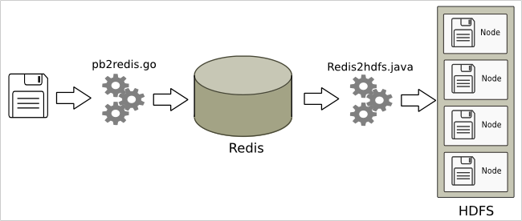
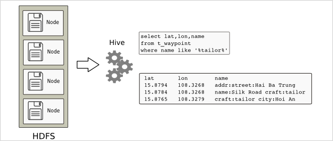

# terentiaflores
Flowers for terentia

This repository contains go/java/bash source code to read the waypoints of an openstreetmap protobuf file and deposit them on HDFS, to be queried via Hive. 

 

The file UdfRoughDistance.java is an example of a Hive User Defined Function. 

A more detailed explanation can be found here: [http://data.munging.ninja/terentiaflores](http://data.munging.ninja/terentiaflores) 

